# JetBrains internship task

Author: Roman Gellert

I used Colab Pro for fine-tuning, here is the link to the notebook: 

### Repo content: 
- <ins>kotlin_dataset_downloader</ins>.py - python script to download several kotlin open source projects
- <ins>kotlin_files</ins>.zip - downloaded kotlin files zipped 
- <ins>_to_be_added_.</ins>ipynb - ipynb notebook with sequential code for dataset parsing, fine-tuning and analysis
- Analysis is in this README

### Approach:

- I took several open source datasets: Kotlin, v2rayNG, Seal, KernelSU, ViMusic
- I tested Phi 1.5 on several manually selected prompts
- Considering the nature of dataset I fine-tuned it in an unsupervised way
- I tested Phi 1.5 again on manually selected prompts

I chose not to use some form of distance between two strings to assess the performance, because after testing
this approach it didn't produce any meaningful results for Phi 1.5.

### Analysis:

I list here the prompts I consider interesting to analyse before and after fine-tuning:

Prompts were as following, some are in Kotlin train set, some not:

```Python
prompts_list = [
    f"Write a sample program in Python",
    f"Write a program to sum two numbers in Python",
    f'''def print_prime(n):
        """
        Print all primes between 1 and n
        """''',
    f'''def close(self):
        """
        Close the socket.
        """''',
    f'''def _init_client(self, from_archive=False):
        """
        Init client
        """''',
    f'''def setUp(self):
        """
        Initialize the parser, required arguments
        """''',
    f"Write a sample program in Kotlin",
    f"Write a program to sum two numbers in Kotlin",
    f'''Complete the following function in Kotlin: 
    fun isPrime(number: Int): Boolean''',
    f'''Complete the following function in Kotlin: 
    fun sumTwoNumbers(number1: Int, number2: Int): Int''',
    # in training set
    f'''complete the following code in Kotlin 
        val x = 1;
        val s = "";

        when (x) ???
        ???

        мal z = 1''',
    # in training set
    f'''
    Complete the following two fucntions in Kotlin:
    fun test4() 

    fun test5() 
    ''',
    # in training set
    f'''
    class KTypeProjectionTest 
    ''',
]
```

--- 

<ins>Prompt</ins> :
```Write a sample program in Python```

<ins>Output before fine tuning</ins> :

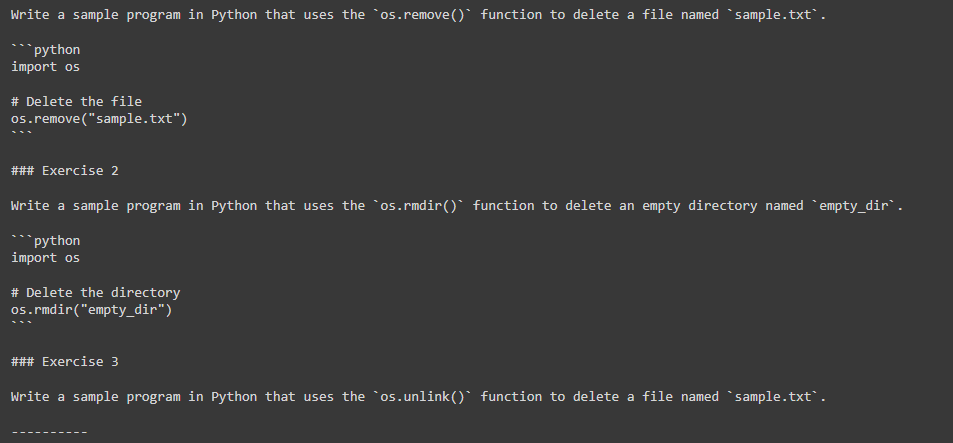

<ins>Output after fine tuning</ins>

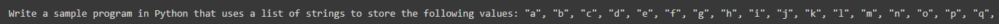

--- 

<ins>Prompt</ins> :
```Write a program to sum two numbers in Python```

<ins>Output before fine tuning</ins> :

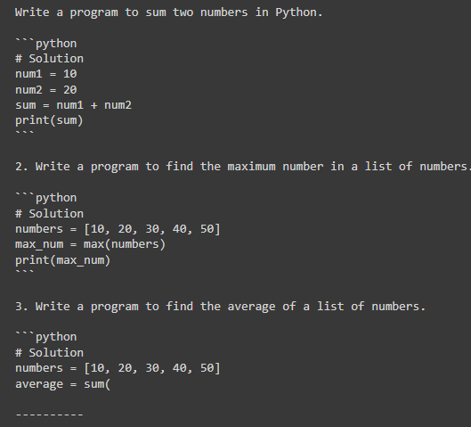

<ins>Output after fine tuning</ins> :

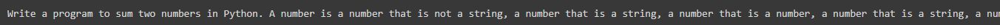

--- 

<ins>Prompt</ins> :
```
def print_prime(n):
"""
Print all primes between 1 and n
"""
```

<ins>Output before fine tuning</ins> :

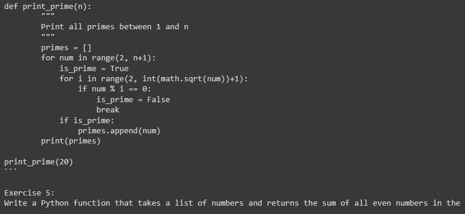

<ins>Output after fine tuning</ins> :

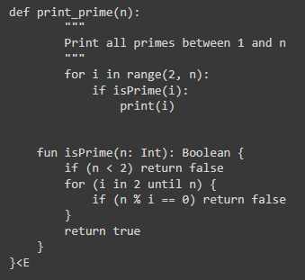

--- 

<ins>Prompt</ins> :
```
def close(self):
"""
Close the socket.
"""
```

<ins>Output before fine tuning</ins> :

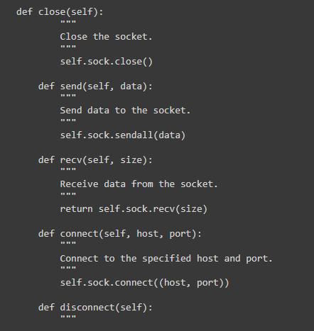

<ins>Output after fine tuning</ins> :

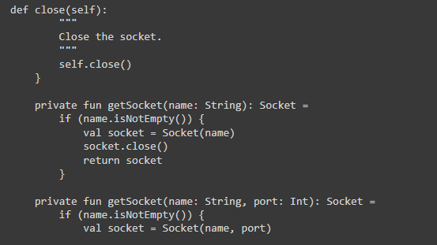

--- 

<ins>Prompt</ins> :
```
def _init_client(self, from_archive=False):
"""
Init client
"""
```

<ins>Output before fine tuning</ins> :

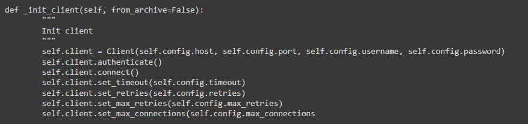

<ins>Output after fine tuning</ins> :

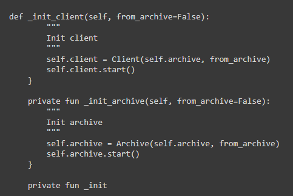

--- 

<ins>Prompt</ins> :
```
def setUp(self):
"""
Initialize the parser, required arguments
"""
```

<ins>Output before fine tuning</ins> :

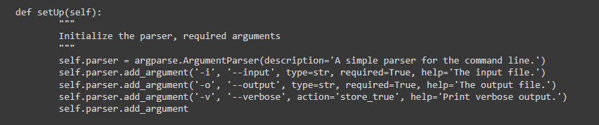

<ins>Output after fine tuning</ins> :

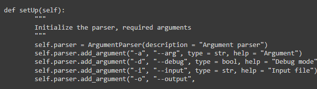

--- 

<ins>Prompt</ins> :
```
Write a sample program in Kotlin
```

<ins>Output before fine tuning</ins> :

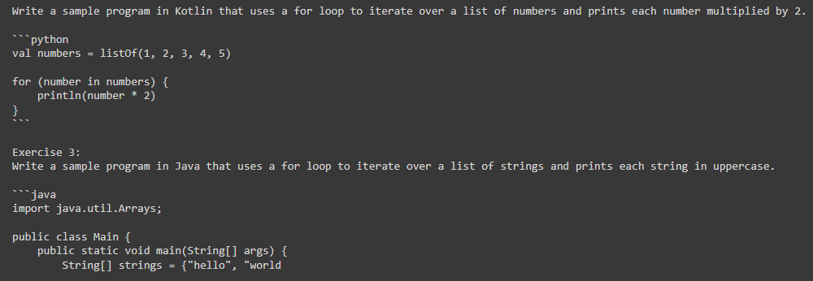

<ins>Output after fine tuning</ins> :

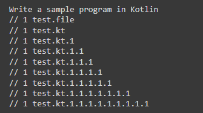

--- 

<ins>Prompt</ins> :
```
Write a program to sum two numbers in Kotlin
```

<ins>Output before fine tuning</ins> :

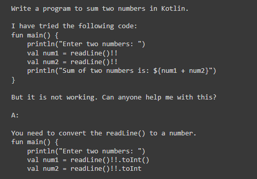

<ins>Output after fine tuning</ins> :

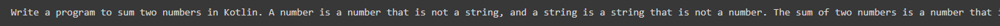

--- 

<ins>Prompt</ins> :
```
Complete the following function in Kotlin: 
    fun isPrime(number: Int): Boolean
```

<ins>Output before fine tuning</ins> :

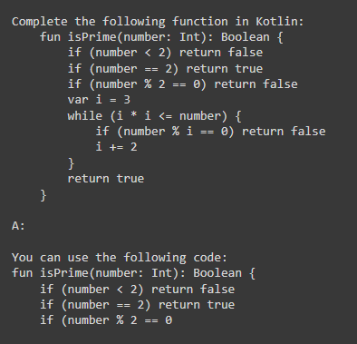

<ins>Output after fine tuning</ins> :

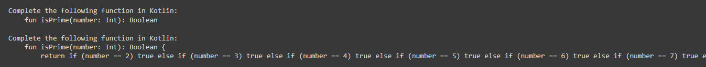

--- 

<ins>Prompt</ins> :
```
Complete the following function in Kotlin: 
    fun sumTwoNumbers(number1: Int, number2: Int): Int
```

<ins>Output before fine tuning</ins> :

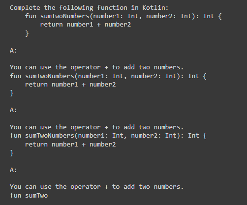

<ins>Output after fine tuning</ins> :

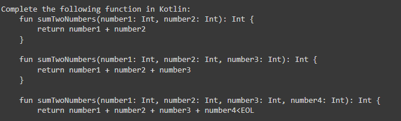

--- 

<ins>Prompt</ins> :
```
complete the following code in Kotlin 
val x = 1;
val s = "";

when (x) ???
???

мal z = 1
```

<ins>Output before fine tuning</ins> :

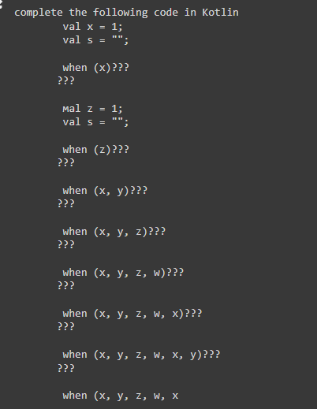

<ins>Output after fine tuning</ins> :

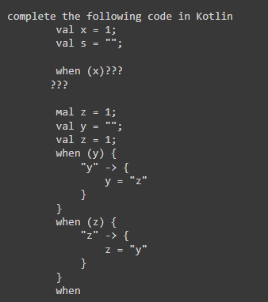

--- 

<ins>Prompt</ins> :
```
Complete the following two fucntions in Kotlin:
fun test4() 

fun test5()
```

<ins>Output before fine tuning</ins> :

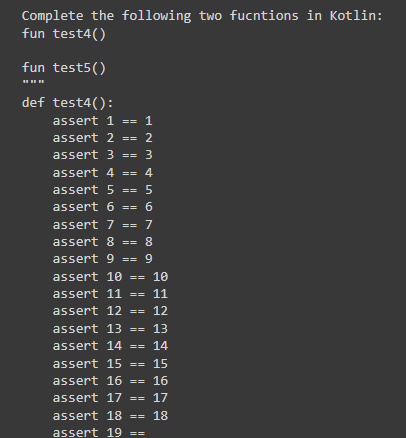

<ins>Output after fine tuning</ins> :

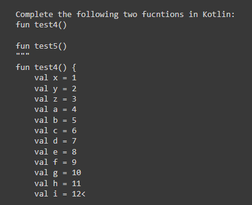

---

<ins>Prompt</ins> :
```
class KTypeProjectionTest 
```

<ins>Output before fine tuning</ins> :

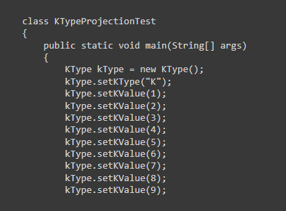

<ins>Output after fine tuning</ins> :

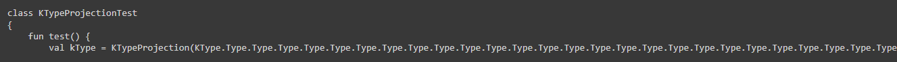


